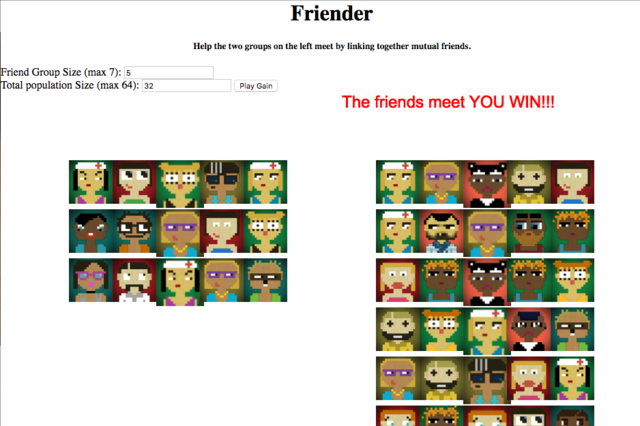

# Friender

A game about helping friends meet! 

I wrote this over the a weekend for [Ludum Dare 38](https://ldjam.com/events/ludum-dare/38)

## Playing

Play [online](https://matthewjosephtaylor.github.io/ludum-dare-38/)




## Building

Prerequisites
- docker
- some unix-like OS (I use mac)

To build just checkout this repository run the command:

```
./build
```

Docker is so that you don't to have various node/webpack etc dependencies. However, if you _do_ have those things installed odds are that this project will build via a simple `webpack` command.

Images are generated 'by hand' via the `get-avatars` command in the [utils](./utils) folder and copying them over into `src/img/64`. I'm using the work of a most excellent [avatar-generator](https://github.com/arusanov/avatar-generator) for these lovely little avatars. 


## Installation

TBD (TODO redirect to live website) 
 
## Contributing
 
1. Fork it!
2. Create your feature branch: `git checkout -b my-new-feature`
3. Commit your changes: `git commit -am 'Add some feature'`
4. Push to the branch: `git push origin my-new-feature`
5. Submit a pull request :D
 
## History

See the [Log](./LOG.md)
 
## Credits

Lovingly coded by Matt Taylor [@matt_taylor](https://twitter.com/matt_taylor)

Avatars generated via: [avatar-generator](https://github.com/arusanov/avatar-generator) 

Graphics Enigine is [Pixi.js](http://www.pixijs.com/)

## License
 
The MIT License (MIT)

Copyright (c) 2017 Matt Taylor

Permission is hereby granted, free of charge, to any person obtaining a copy of this software and associated documentation files (the "Software"), to deal in the Software without restriction, including without limitation the rights to use, copy, modify, merge, publish, distribute, sublicense, and/or sell copies of the Software, and to permit persons to whom the Software is furnished to do so, subject to the following conditions:

The above copyright notice and this permission notice shall be included in all copies or substantial portions of the Software.

THE SOFTWARE IS PROVIDED "AS IS", WITHOUT WARRANTY OF ANY KIND, EXPRESS OR IMPLIED, INCLUDING BUT NOT LIMITED TO THE WARRANTIES OF MERCHANTABILITY, FITNESS FOR A PARTICULAR PURPOSE AND NONINFRINGEMENT. IN NO EVENT SHALL THE AUTHORS OR COPYRIGHT HOLDERS BE LIABLE FOR ANY CLAIM, DAMAGES OR OTHER LIABILITY, WHETHER IN AN ACTION OF CONTRACT, TORT OR OTHERWISE, ARISING FROM, OUT OF OR IN CONNECTION WITH THE SOFTWARE OR THE USE OR OTHER DEALINGS IN THE SOFTWARE.